# RentEase

RentEase is a web portal for a property management app. It helps manage buildings, rental units, tenants and monthly rent payments. Admins see everything, and Property Managers see only the buildings given to them.

---

## Live links

- **Frontend:** https://rentease-client.netlify.app/
- **Backend:** https://renteasecare-server.vercel.app

---

## Setup guide

You need Node.js, npm and a MongoDB database (MongoDB Atlas is fine).

### Backend

```bash
cd server
npm install
cp .env.example .env    # on Windows: copy .env.example .env
npm run seed            # adds the demo data
npm run dev             # runs on http://localhost:5000
```

Fill in `.env` before you run the seed. This is `server/.env.example`:

```env
PORT=5000
DATABASE_URL=mongodb+srv://<user>:<password>@<cluster>.mongodb.net/rentease
BCRYPT_SALT_ROUNDS=10
JWT_ACCESS_SECRET=change-me
JWT_REFRESH_SECRET=change-me-too
JWT_ACCESS_EXPIRES_IN=1d
JWT_REFRESH_EXPIRES_IN=7d
APP_URL=http://localhost:5173
```

> The seed deletes the old data in the app's collections first. Do not run it on a database with real data.

### Frontend

Open a new terminal:

```bash
cd client
npm install
npm run dev             # runs on http://localhost:5173
```


---

## Demo logins

Password for all users: `123456`

| Role | Email |
| --- | --- |
| Admin | admin@rentease.com |
| Property Manager | tanvir@rentease.com |
| Property Manager | ramim@rentease.com |

---

## System architecture

```text
Browser (React + Vite)
   |  Axios sends the cookies automatically (withCredentials)
   v
Express API: routes -> controllers -> services -> models
   |  auth middleware checks the cookie and the role on every route
   v
MongoDB (Atlas)
```

---

### 1. Property list

**Used in:** `server/src/app/modules/property/property.service.ts` → `getAllPropertiesService` (called by `GET /properties`)

```ts
// filter for the search and the city
const filter: Record<string, unknown> = {};
if (query.searchTerm) {
  filter.name = { $regex: escapeRegex(query.searchTerm), $options: "i" };
}
if (query.city) filter.city = query.city;

const result = await Property.aggregate([
  roleScopeMatch(user),
  { $match: filter },
  {
    $facet: {
      data: [
        { $sort: { createdAt: -1 } },
        { $skip: skip },
        { $limit: limit },
        {
          $project: {
            name: 1,
            address: 1,
            city: 1,
            managers: 1,
            createdAt: 1,
          },
        },
      ],
      total: [{ $count: "count" }],
    },
  },
]);
```

Step by step:

1. **`roleScopeMatch(user)`**: first, we limit the data by role. An admin gets everything. A manager gets only the properties that have their id in `managers`. This runs first, so a manager never sees other data, and MongoDB can use the `managers` index.
2. **`$match: filter`**: then we search by name and filter by city.
3. **`$facet`**: then we run two small pipelines at the same time on the same data:
   - **`data`** (the rows of the page):
     1. `$sort`: newest first.
     2. `$skip`: skip the rows of the earlier pages.
     3. `$limit`: keep only one page of rows.
     4. `$project`: send only the fields the frontend needs.
   - **`total`**: `$count` counts all matching rows. We use it for the page numbers.

### 2. Unit list

**Used in:** `server/src/app/modules/unit/unit.service.ts` → `getAllUnitsService` (called by `GET /units`)

```ts
// filter for the property and the status
const filter: Record<string, unknown> = {};
if (query.property) filter.property = new Types.ObjectId(query.property);
if (query.status) filter.status = query.status;

const result = await Unit.aggregate([
  await propertyScopeMatch(user),
  { $match: filter },
  {
    $facet: {
      data: [
        { $sort: { createdAt: -1, _id: -1 } },
        { $skip: skip },
        { $limit: limit },
        {
          $lookup: {
            from: "tenants",
            localField: "_id",
            foreignField: "unit",
            pipeline: [
              { $match: { moveOutDate: null } },
              { $project: { name: 1, phone: 1 } },
            ],
            as: "currentTenant",
          },
        },
        {
          $unwind: { path: "$currentTenant", preserveNullAndEmptyArrays: true },
        },
        {
          $project: {
            property: 1,
            unitNumber: 1,
            floor: 1,
            monthlyRent: 1,
            status: 1,
            currentTenant: 1,
          },
        },
      ],
      total: [{ $count: "count" }],
    },
  },
]);
```

Step by step:

1. **`propertyScopeMatch(user)`**: first, we limit the data by role. An admin gets everything. A manager gets only the units whose `property` is one of their assigned properties.
2. **`$match: filter`**: then we filter by property and by status (vacant or occupied). This uses the `property + status` index.
3. **`$facet`**: then we run two small pipelines at the same time:
   - **`data`** (the rows of the page):
     1. `$sort`: newest first.
     2. `$skip`: skip the rows of the earlier pages.
     3. `$limit`: keep only one page of rows.
     4. `$lookup`: for each unit on the page, we find its current tenant in the `tenants` collection (the tenant with no `moveOutDate`). We do this after `$limit`, so it runs for only a few rows and not for every unit.
     5. `$unwind`: `$lookup` gives an array, so we turn it into one object. `preserveNullAndEmptyArrays: true` keeps the vacant units that have no tenant.
     6. `$project`: send only the fields the frontend needs.
   - **`total`**: `$count` counts all matching units for the page numbers.

---

## Technical decisions

### 1. Role-based access

One `auth(...roles)` middleware runs on every route and puts the user in `req.user`. Two helper functions build the first `$match` stage: one for properties and one for units, tenants and payments. If a manager asks for another manager's data, the API answers "Not found".

### 2. Cookie login with refresh in the backend

The tokens are in httpOnly cookies, so JavaScript cannot read them. If the access token is missing or expired, the `auth` middleware uses the refresh token to make a new one and continues the same request. If the refresh token is also bad, the API sends `SESSION_EXPIRED` and the frontend goes to the login page.


---

## AI usage

I used **Claude** to help me plan and write code.

**One example where I changed the output:** I cleared the access token cookie by hand and then made another request. I wanted the app to notice this and call the refresh token route by itself to get a new access token. I wanted this handled in the **backend**, but Claude gave me a **frontend** solution (an Axios interceptor). I read it, took the idea from it, changed it, and built it in the **backend** `auth` middleware. Now the server makes a new access token when the old one is missing or expired, and the same request still works.

---

## Screenshots

**Admin**

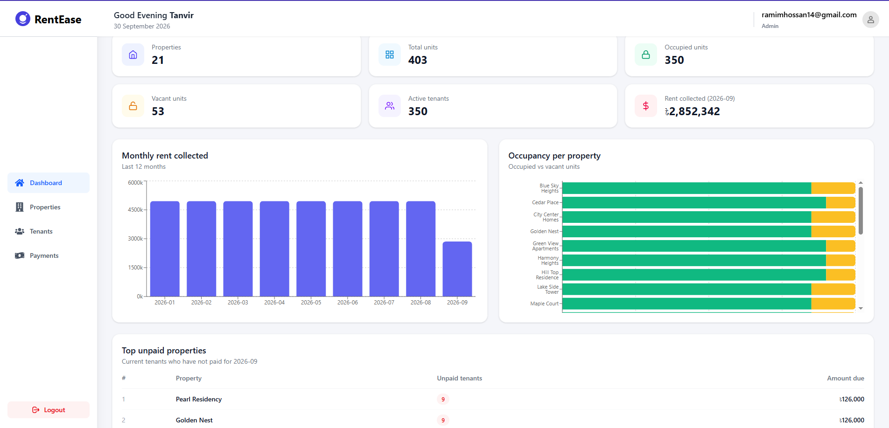
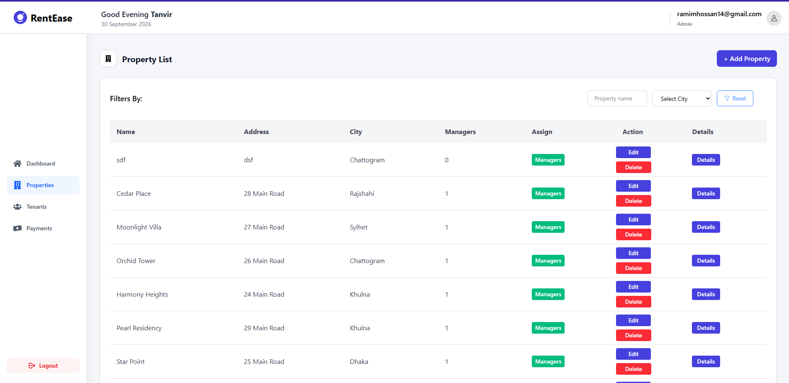
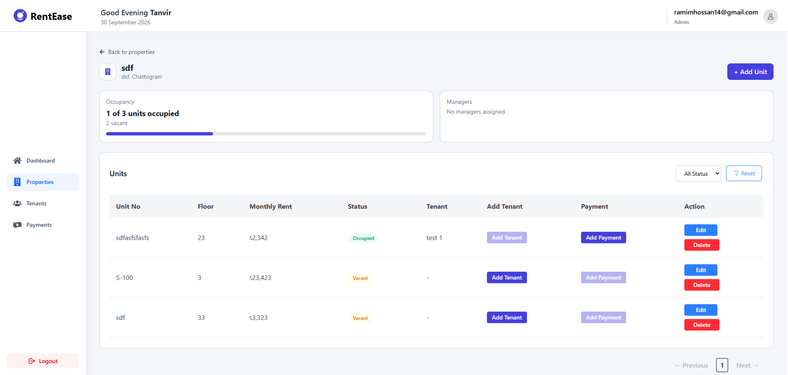
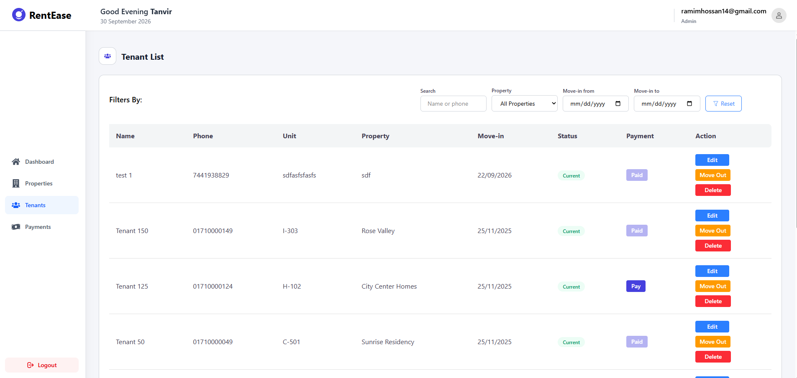
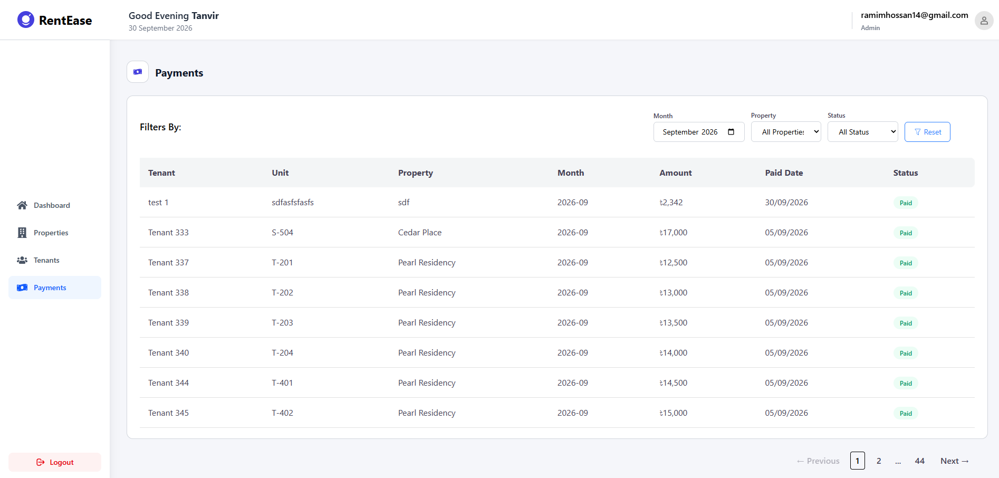

**Manager**

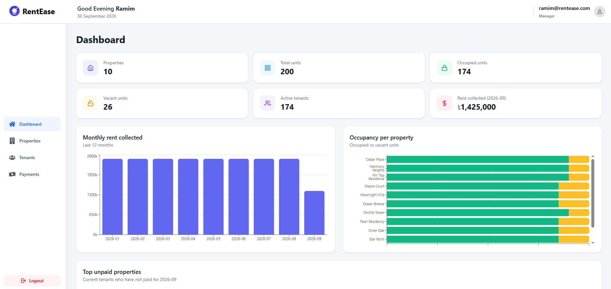
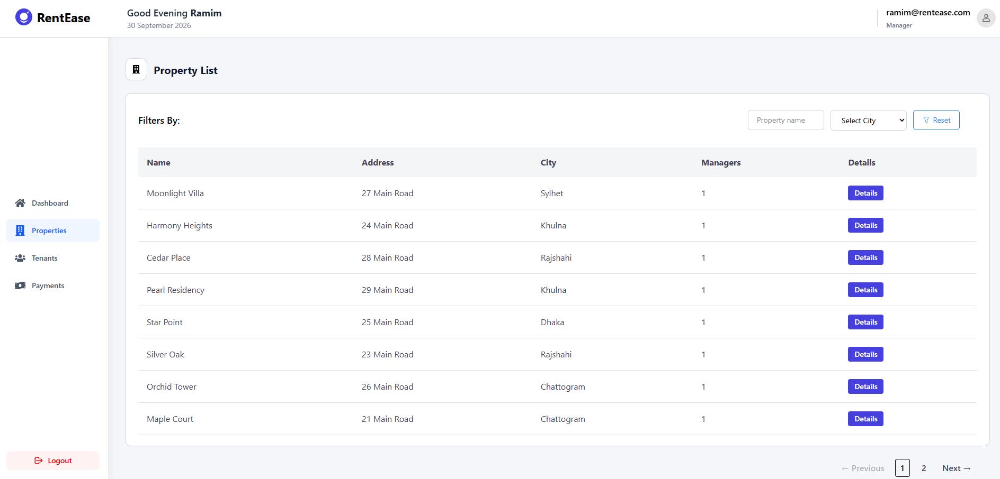


**Mobile**

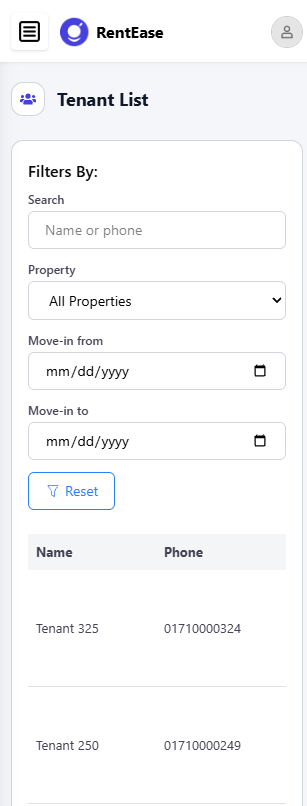
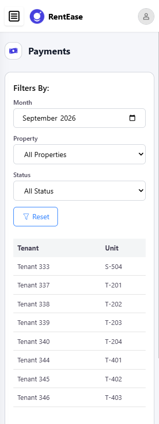
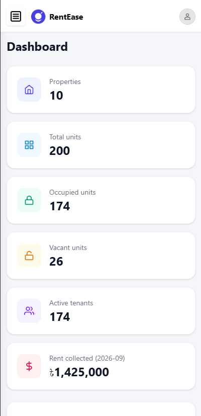
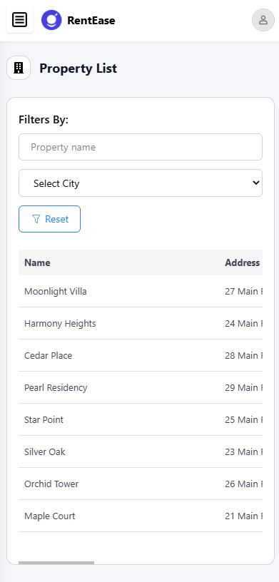


